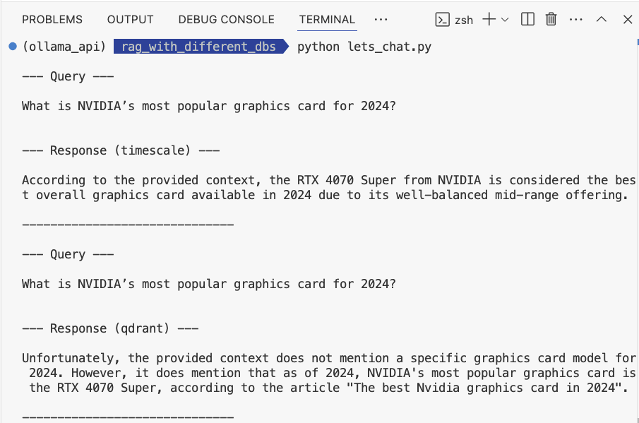

# **rag_with_different_dbs**

## **Separately creating local RAG Apps with different databases.**

### **Content** 

* [Ⅰ. Purpose](#1)
* [Ⅱ. Tools or Software](#2)
* [Ⅲ. Statement](#3)
* [Ⅳ. Results](#4)
* [Ⅴ. References](#5)

 

---

<h4 id="1">Ⅰ. Purpose</h4>
This project will make an experiment of separately building local RAG (Retrieval-augmented generation) Apps with different databases, including TimescaleDB and Qdrant. 
  

<h4 id="2">Ⅱ. Tools or Software</h4>

Ollama, Qdrant, TimescaleDB, Python, Docker
  

<h4 id="3">Ⅲ. Statement</h4>

1.Framework 

Two loal RAG Apps are composed as below. 
(1)Ollama + llama3 + nomic-embed-text + TimescaleDB 
(2)Ollama + llama3 + nomic-embed-text + Qdrant 

Then, there are primary three parts for the local RAG App. 
(1)Read text files from the folder. 
(2)Process data with Model and then save into databases. 
(3)Input query string and then return the answer. 

2.Model 

| Model Name| Parameters | Details |
|:--:|:--:|:--:|
| llama3.2 | 3B | please refer to [Ollama Library](<https://ollama.com/library/llama3.2>) |
| nomic-embed-text | - | please refer to [Ollama Library](<https://ollama.com/library/nomic-embed-text>) |
 

<h4 id="4">Ⅳ. Results</h4>

The answer with TimscaleDB, the top in the picture below, is resonable, as same as the simulated content in text files.  
Besides, the answer with Qdrant, the bottom in the picture below, is fair, as similar as the simulated content in text files.  

 
  

__The above provides local RAG (Retrieval-augmented generation) Apps with different databases. Definitely, that can be expanded and applied.__ 

(Concerning to the details, please refer to the files of this project)

 
 

---

<h4 id="5">Ⅴ. References</h4>

[1] [Ollama](<https://ollama.com/>)

[2] [llama3.2](<https://ollama.com/library/llama3.2>)

[3] [Qdrant Documentation](<https://qdrant.tech/documentation/>)

[4] [Qdrant - API Reference](<https://api.qdrant.tech/v-1-13-x/api-reference>)

[5] [Timescale - Docs](<https://docs.timescale.com/>) 
